# JRC Editor User's Guide

## Version 3.0

## Contents

- [Introduction to the JRC Editor](#intro)
  - [What Can You Do with the Java Resource Editor](#what_can)
  - [When To Use the Java Resource Editor](#when_to_use)
- [Internationalization concept overview](#concept)
- [Installing the Java Resource Editor](#install)
  - [Requirements](#requirements)
  - [Installation procedure](#procedure)
- [Using JRC Editor](#usage)
  - [Application start](#start)
  - [Editing existing resources](#existing)
  - [Creating new resources](#creating_new)
  - [Inserting new keys](#new)
  - [Renaming keys](#rename)
  - [Deleting keys](#delete)
  - [Adding new language](#new_lang)
  - [Tree manipulations](#tree)
  - [Import/Export](#ie)
  - [Fast navigation](#nav)
  - [Search / Search and Replace](#search_repl)
  - [Importing resources from external sources](#import)
    - [Importing resources from *.java files](#importJava)
    - [Importing resources from *.jar package](#importJar)
  - [Resource stencil source code generation](#generation)
  - [Understanding Join/Merge features](#join_merge)
  - [Null keys](#nulls)
  - [Statistics](#statistics)
  - [Preferences](#prefs)
- [Configuring JRC Editor](#config)
- [Command-line tool](#command-line)
  - [Operating With Command-line version of JRC Editor](#command-line_options)
- [Product limitations](#limits)
- [Further product plans](#plans)
- [References](#refs)

## <a id="intro" href="#intro">Introduction to the JRC Editor</a>

Since JDK 1.1.x. Sun introduced Internationalization concept for Java.

> *Internationalization* is the process of designing an application so that it can be adapted to various languages and regions without engineering changes.
>
> *Localization* is the process of adapting software for a specific region or language by adding locale-specific components and translating text.

*The JavaTM Tutorial*

The text used in programs is locale dependent, that's why we store all text strings in the separate files as a key-value pairs.
When we need to localize a program for yet another language support we have to translate values in these files to the desired language.
And that's all!
These files are called resources.
We provide GUI tool to manipulate these resources.
The files being produced by this tool is fully compatible with ResourceBundle expectations.

So, the JRC Editor (also known as Java Resource Editor) solution is small and easy-to-use visual editor for resource files.

## <a id="what_can" href="#what_can">What Can You Do with the Java Resource Editor</a>

JRC Editor is not a simply editing tool - it provides rich and flexible way to manage text-based resources.
In fact, you are able to make any distributed translations as you want in several forms outside JRCE.
But in all cases you will need to merge all changes after translation and do a clean up texts being translated; and JRC Editor
provides all necessary features to accomplish these tasks.

The Java Resource Editor can be used for new and existing software localization, resources synchronization and any other resources manipulations.

It provides full support for any language specific resources (it depends on the fonts and font metrics settings of
the host OS at your computer).
The target of this tool is localization strings manipulation for all Java-based software that has appropriate support embedded.

## <a id="when_to_use" href="#when_to_use">When To Use the Java Resource Editor.</a>

The JRC Editor is best used for regular access to various resource files.
You can add your own language support to the existing software if strings are not hard-coded to the software.
One of the greatest things in the internationalization is that you don't need to make code changes.

Another great area in this tool usage is resource bundle synchronization.
Our tool can handle this task easily - it compares the files set and highlights all differences.
It allows separating development process and resource management process.
That's why this tool can be used as part of your software pack to provide 3rd party localization.

## <a id="concept" href="#concept">Internationalization concept overview</a>

Internationalization means that developers can customize their product for different languages and locales.
In Java language terms this task handles by ResourceBundle class (see [[1,2,3,4](#refs)]).
All resource files' names have two parts: resource name and localization suffix.
When you want your program to 'speak' French, for example, the only thing you need to do is adding corresponding properties file.
This procedure does not require any interaction with the software creator.

## <a id="install" href="#install">Installing the Java Resource Editor</a>

We did our best to make the installation procedure of the product easy, so just follow the instructions.

## <a id="requirements" href="#requirements">Requirements</a>

To use the JRC Editor you need a JDK/JRE installed on your computer. OpenJDK Verison 1.8 (8) and OpenJDK 11 were used during development.

## <a id="procedure" href="#procedure">Installation procedure</a>

Please, download the package corresponding to your OS to make the installation process easier.

1. **Installing on Microsoft Windows (jrc-editor-2.0.X-setup.exe)**

    Run the installation wizard and simply follow the instructions:
    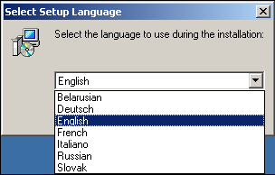

    **Screenshot 1. Choosing installation language**

    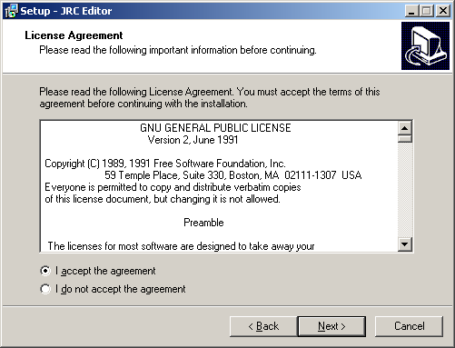

    **Screenshot 2. Accepting the GNU General Public License agreement**

    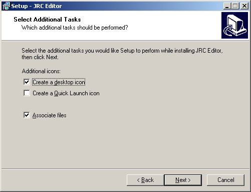

    **Screenshot 3. Additional options**

2. **Installing on Unix/Linux (jrc-editor-2.0.X-1.i586.rpm)**

    Use rpm: rpm -i jrc-editor-2.x.x-x.i386.rpm

3. **Installing on any OS (jrc-editor-2.0.X.tar.gz)**

    Unpack zip/tarball with JRC Editor to an empty directory.
    Use the appropriate launcher for your platform to start JRC Editor.

## <a id="usage" href="#usage">Using JRC Editor</a>

## <a id="start" href="#start">Application start</a>

To start this application you need simply start corresponding batch file.
When the application is started you are able to manipulate resource files.

## <a id="existing" href="#existing">Editing existing resources</a>

Java Resource Editor consists of two panels displayed on Screenshot 1.
To start working with your resource set you should make several steps:

- From the **File** menu, choose **Open** or **New resource**.
- In the opened dialog select resource file that meets mentioned requirements.

**Note:** the files previously opened will be closed automatically.

Left panel is a key hierarchy that was stripped out from the appropriate resource files set.
The key hierarchy is created automatically using "`.`" or "`_`" as a separator (see section [Preferences](#prefs)).
So, adding "`.`" in key name automatically creates new hierarchy level.

Right panel displays a list of the languages defined by the resource files set and values assigned to them.

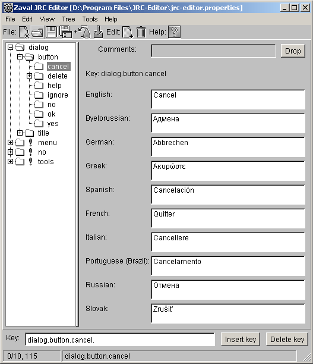

**Screenshot 4. Working area of the Java Resource Editor**

To hide a language from the right panel go through the following steps:

- From the **View** menu, select **Show resource**.
- In the **Show resource** list, clear a checkbox next to the language.

To edit key property for any language available do the following:

- In the left panel select item you want to edit - it will appear in the **Key** field at the bottom of the panel (in our example `dialog.button.help`).
- In the right panel make necessary changes to the corresponding field (see Screenshot 4).

**Note:** starting from version 2.0 you can use Shift and Ctrl key for fast navigation inside text.

To apply changes use **File -> Save** from the top menu or press on the  (Save) icon.
Resource file's name consists of base name (e.g. '`editor`'), language suffix (e.g. '`de`'), and `.properties`
extension, for example, `editor_de.properties` (German), `editor_fr.properties` (French).
In our example `jrc-editor.properties` file contains default English messages and is displayed in the title of the Java Resource Editor's panel.

To save all files with a different base name and/or write them to a different directory, use **File -> Save as** or press  (Save As...) icon instead.

## <a id="creating_new" href="#creating_new">Creating new resources</a>

There are several ways to create new resources: either enter them by hands, or importing them from *.java files.
For more info see [Importing resources from external sources](#import) section.

## <a id="new" href="#new">Inserting new keys</a>

To add your own items to the tree proceed through the following steps:

- In the **Key** field, type tree key, for example `dialog.button.new`.
- Press Insert button.
- Fill in all Key's values.
- Repeat these steps for all items you want to add.

## <a id="rename" href="#rename">Renaming keys</a>

To rename a key or key hierarchy you should do the following:

- Choose a key to rename.
- Choose **Rename key** from the right mouse context menu or use **Edit -> Rename key** (see Screenshot 5).

    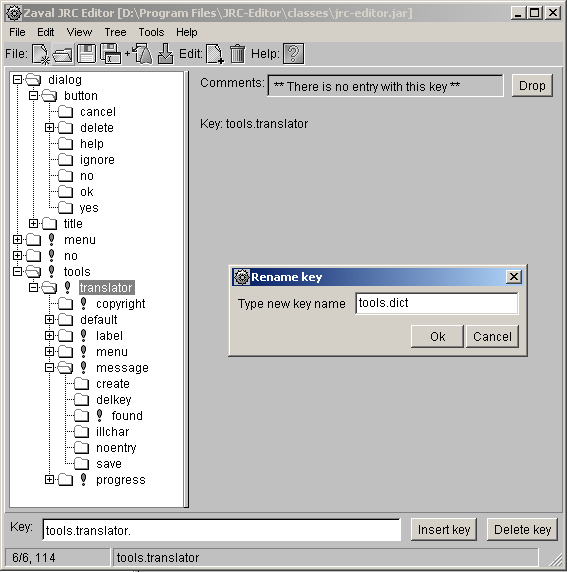

    **Screenshot 5. Renaming key - entering new name**

- Enter new key name.

    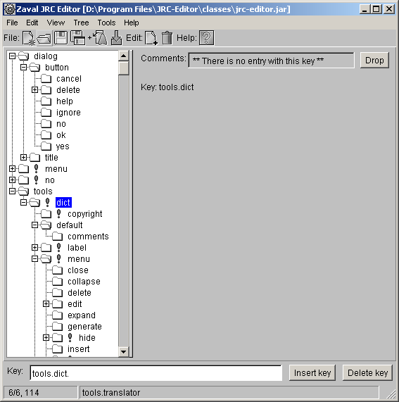

    **Screenshot 6. The whole sub-tree was renamed**

    The whole underlying key hierarchy was renamed.

## <a id="delete" href="#delete">Deleting items</a>

The remove a key-value pair do the following:

- Select the appropriate key at the left panel.
- Press **Delete** button.
- You will be asked either you want to remove this key with all sub-keys or this key only.

**Note:** removing keys from the `.properties` file by hand may cause your application to fail.
Think over before you proceed.
Unused keys will do no harm to the application stability.

## <a id="new_lang" href="#new_lang">Adding new language</a>

Adding new language is simple:

- Choose **Edit -> New language**.
- In the **New resource** dialog (see Screenshot 7), enter resource file suffix, for example, `fr`.
    When you click OK corresponding `.properties` file will be created (in our example `jrc-editor_fr.properties`) and edit fields for French language will appear in the right panel.

    Note: for information on language codes (suffixes you need) see [[6,7](#refs)].
    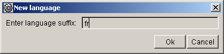

    **Screenshot 7. Adding new language**

    An exclamation mark next to tree node notifies you that there is at list one item in this node that is not translated into all languages displayed in the right panel (see Screenshot 8).

    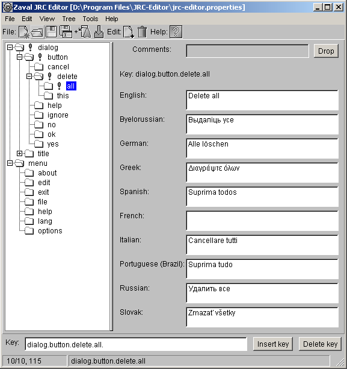

    **Screenshot 8. Resources synchronization**

    In our example missing translation is French.
    After filling in the filed near French exclamation mark will disappear.

## <a id="tree" href="#tree">Tree manipulations</a>

To make your life easier when working with really big files we added expand/collapse functionality to whole tree and any of its nodes.
This feature is available under **Tree** menu and starting from version 2.0 from context menu (available with mouse right-button click).

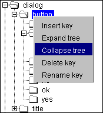

**Screenshot 9. Context menu**

## <a id="ie" href="#ie">Import/Export</a>

Starting from version 1.2 JRC Editor supports data import/export from/to single XML file (UTF-8 encoding) or single plaintext file (Unicode).
Formats are pretty simple, so there shouldn't be any problems.

While exporting to Unicode you may choose to either export all resources or just choose only those you need.

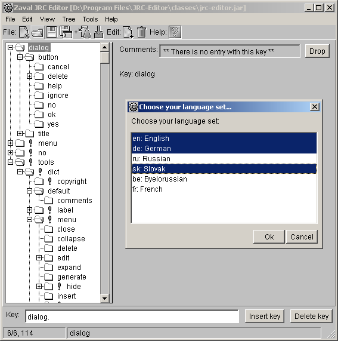

**Screenshot 10. Export to Unicode (Split into Unicode file)**

Unicode file format:

~~~~plain
KEY="key.name"
  "language1"="value1"
  "language2"="value2"
  "language3"="value3"
~~~~

Example:

~~~~plain
KEY="dialog.button.cancel"
  "en"="Cancel"
  "sk"="Zrusit"
  "de"="Abbrechen"
~~~~

XML file format:

~~~~xml
<xml>
  <key name="key.name">
    <value lang="language1">value1</value>
    <value lang="language2">value2</value>
  </key>
</xml>
~~~~

Example:

~~~~xml
<xml>
  <key name="dialog.button.cancel">
    <value lang="en">Cancel</value>
    <value lang="sk">Zrusit</value>
    <value lang="de">Abbrechen</value>
  </key>
</xml>
~~~~

## <a id="nav" href="#nav">Fast navigation</a>

To make your life easier we have added shortcuts support for all important actions.
For example: Save - Ctrl+S, Open - Ctrl+O, etc.

Starting from version 1.2 you can access all JRC Editor functions without a mouse support - you can navigate through all JRC Editor controls with Tab key, access upper menu functions using shortcuts and more.

## <a id="search_repl" href="#search_repl">Search / Search and Replace</a>

Starting from version 2.0 JRC Editor supports Search and Search and replace functions.

**Screenshot 11. Search dialog**

Search dialog supports almost all options possible:

- **Exact substring match** - only exact substring will be matched.
- **Shell-like mask expression** - it is possible to use simple masks like you used in MS-DOS for searching files.
    I.e. symbol '`*`' is treated as any character sequence, '`?`' as any single symbol, and '`[]`' as one character of the list specified in square braces.
- **Perl-like regular expression** - see 'man perlop' and 'man perlre' for details.

    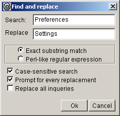

    **Screenshot 12. Search and Replace dialog**

## <a id="import" href="#import">Importing resources from external sources</a>

With JRC Editor you can easily import resources from either `*.java` file, `*.jar` archive (in release 2.0 all `*.properties` files found in this archive will be merged in one file), XML file or from Unicode file.

## <a id="importJava" href="#importJava">Importing resources from *.java files</a>

To simplify existing applications transfer to the resources usage you can use **Parse source...** option.
It goes through java source, extracts text strings and builds tree-like structure based on class name/package name.
In version 2.0 you can import resources only from one file at a time and can't do iterations.

Importing process doesn't get all strings but only those that look right: for example, it wouldn't import any single-character strings.

## <a id="importJar" href="#importJar">Importing resources from *.jar package</a>

Starting from version 2.0 we have added **Import resource from JAR...** option.
How it works:
it goes through archive (as far as you should know jar is a zip archive), finds all files with extension `*.properties`, merges all of them in single resource bundle regarding to the language extensions.
In version 2.0 you don't have possibility to specify which resource file to import from `*.jar` and which - not to import.

## <a id="generation" href="#generation">Resource stencil source code generation</a>

Stencil is a java source that contains all resource strings with their initialization and corresponding getters/setters. Initialization requires appropriate resource bundle.

To generate use **File -> Generate source code...**.

## <a id="join_merge" href="#join_merge">Understanding Join/Merge features</a>

You can use JRC Editor with the following way:

1. Define new language inside JRC Editor;
2. Export only two languages: English and languages you've selected;
3. Send content being exported into unicode text file to any translators;
4. People who translates text works separately without intersections;
5. All content being translated able to merged back into common pool.

As you see, initial and final phases can be managed efficiently with JRC Editor tool, but real translation process can be done either with JRC Editor or without it - you can choose the most appropriate method you need.

## <a id="nulls" href="#nulls">Null keys</a>

Null keys or blank keys are keys that have no value for all languages.
Often it can be useful to see all of them (see **View -> Indicate blank resources**).

## <a id="statistics" href="#statistics">Statistics</a>

Sometimes it is useful to see statistics over files you are working with, so we added this functionality (see **View -> Statistics**).

## <a id="prefs" href="#prefs">Preferences</a>

There are several options that can be modified in run-time. They are available under **View -> Preferences**.

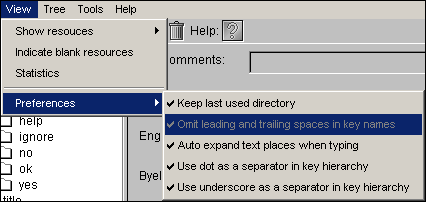

**Screenshot 13. Preferences**

Namely:

- **Keep last used directory**: controls what directory you will see while doing multiple Open, Save as... and other file operations.
- **Omit leading and trailing spaces in key names**: controls whether leading and trailing spaces are kept or removed from key names (in version 2.0 this option can not be changed).
- **Auto expand text places when typing**: in the right panel when you entering new value for any key text area will be automatically enlarged when needed.
- **Use dot as a separator in key hierarchy**: to build the tree in the left panel we need to know the separator in key names, this option just let JRC Editor use dot ('`.`') as a separator.
- **Use underscore as a separator in key hierarchy**: to build the tree in the left panel we need to know the separator in key names, this option just let JRC Editor use underscore ('`_`') as a separator.

## <a id="config" href="#config">Configuring JRC Editor</a>

Some JRC Editor's functions can be configured via command-line options.
These options are global and cannot be changed during JRC Editor execution.
All options can be set via standard '`set`' command, or can be attached to command line with '`-D`' parameter before main class name (the main class name is '`org.zaval.tools.i18n.translator.JrcEditor`').

Options:

- '`user.language`' and '`user.region`'

    This option can be used to override your system locale.
    For example, if locale in your system is set to English (US) and you want to start JRC Editor with Italian interface you can do this by specifying `user.language=it` and `user.region=IT`.

**Example**

To start JRC Editor with Italian GUI:

~~~~cmd
java -Duser.language=it -Duser.region=IT -jar classes/jrc-editor.jar %1 %2 %3 %4 %5 %6 %7 %8 %9
~~~~

## <a id="command-line" href="#command-line">Command-line tool</a>

Starting from v1.3.1 JRC Editor goes with command-line tool that allows you doing all resource bundles manipulations automatically, including split and merge features for every language you've set.
Command line tool allows doing the same things as JRC Editor tool provides interactively, including source files parsing and code generation.

## <a id="command-line_options" href="#command-line_options">Operating With Command-line version of JRC Editor</a>

JRC Editor command-line tool has the following syntax:

`join srcFile ... addFile`

or

`split srcFile dstFile [lang ...]`

where

- **`srcFile`** - a root file of properties bundle set. If this file does not exist it will be created automatically if needed; otherwise all data will be joined with content being added previously; the same keys will be replaced from addFile files if specified.
- **`dstFile`** - XML or UCS16 text file. This file will be created from scratch (if file with the same name already exists it will be replaced).
    File type will be determined by extension of file specified (`.txt`, `.java`, or `.xml` can be used here).

    You able to use this command to generate Java code stub files, but in this case all language parameters will be omitted.
    To use this feature you need to specify '`.java`' file extension here.
- **`addFile`** - XML, Java, other bundle set or UCS-16 file.
    Content of these files will be joined with `srcFile` content, and `srcFile` will be replaced with new one.
    There is a common situation when the same keys exist in several files at once - join operation goes sequentially, so in this case last file will have higher priority.
- **`lang`** - locale abbreviation (suffix of slave properties files).
    You can specify any language bi-literal codes here, such as `en`, `ru`, `de`, or any other values for east asian languages.
    All languages being specified will be added to appropriate target file.
    If no languages specified file will contain only key names without any translations.

## <a id="limits" href="#limits">Product limitations</a>

There are several product limitations that can be fixed in future versions:

- You can't operate with multiple resource sets - only one resource set available at a time.
- You cannot analyze a lot of Java sources at a time.
- You cannot split all lines being generated to multiple targets (Java files).

## <a id="plans" href="#plans">Further product plans</a>

Current tool implementation follows the minimalist computing concept. In near future the following features will be added:

- Ability to merge different resource sets;
- Ability to split one existing resource set to multiple ones;
- Code generation and analysis improvements and multiple operations support;
- Automated machine translation and spell-checking support.

## <a id="refs" href="#refs">References</a>

1. [The JavaTM Tutorial -> Internationalization](http://java.sun.com/docs/books/tutorial/i18n/)
2. [Java Platform -> Basic Features -> Internationalization](http://java.sun.com/j2se/1.4.2/docs/guide/intl/)
3. [Technical Articles and Tips -> Internationalization and Localization](http://java.sun.com/developer/technicalArticles/Intl/)
4. [Designing Enterprise Applications with the J2EE Platform, Second Edition](http://java.sun.com/blueprints/guidelines/designing_enterprise_applications_2e/) see **Chapter 10: J2EE Internationalization and Localization**
5. [Java 2 Platform, Standard Edition (J2SE)](http://java.sun.com/j2se/)
6. [Codes for the Representation of Names of Languages](http://www.loc.gov/standards/iso639-2/englangn.html)
7. [Code for the representation of names of languages (ISO 639:1988)](http://www.ics.uci.edu/pub/ietf/http/related/iso639.txt)

----

Original idea: Victor Krapivin. Developed under Zaval Creative Process.

----

Copyright &copy; Zaval Creative Engineering Group, 2000-2002.
Copyright &copy; Christoph Obexer, 2018-2019.

----

Distributed under GPL v2. All Rights Reserved.
